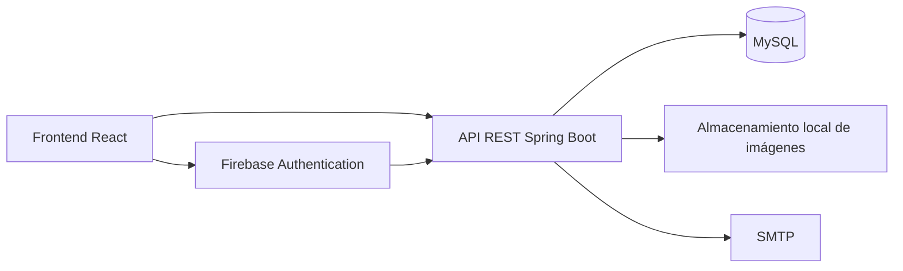
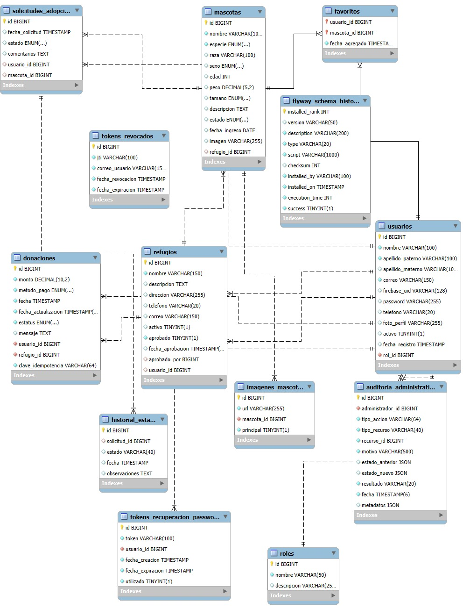

<div align="center">

INSTITUTO TECNOLÓGICO DE OAXACA  
Ingeniería en Sistemas Computacionales  
Programación Web  

# HUELLITAS OAXACA

### Plataforma web para la adopción responsable de mascotas

Docente:  
Mtra. Adelina Martínez Nieto

Alumnos:  
Méndez García Ángel de Jesús  
Mendoza Jiménez Melody Nathalie

Oaxaca de Juárez, Oaxaca  
Julio de 2026

</div>

# 1. Presentación

Huellitas Oaxaca es un proyecto académico desarrollado para la asignatura de Programación Web del Instituto Tecnológico de Oaxaca. La plataforma centraliza información sobre mascotas disponibles para adopción y facilita la interacción entre personas adoptantes, refugios y administradores.

El sistema integra un frontend web, una API REST, una base de datos relacional y mecanismos de autenticación y autorización por roles.

# 2. Descripción del proyecto

La plataforma permite consultar mascotas disponibles, revisar sus características, iniciar solicitudes de adopción, guardar mascotas favoritas y registrar donaciones simuladas para refugios.

También incluye áreas privadas para la administración de perfiles, la gestión de refugios, la publicación de mascotas y la administración de usuarios y refugios.

# 3. Problemática

La información sobre mascotas en adopción suele encontrarse dispersa en redes sociales y publicaciones independientes. Esto dificulta localizar perfiles actualizados, consultar datos relevantes y dar seguimiento ordenado a las solicitudes de adopción.

## 3.1 Justificación

Huellitas Oaxaca propone una plataforma centralizada que facilita la consulta de mascotas y organiza la información relacionada con usuarios, refugios, solicitudes, imágenes y donaciones simuladas.

La solución contribuye a presentar el proceso de adopción de forma más clara y ordenada, sin sustituir la comunicación directa ni los procedimientos propios de cada refugio.

# 4. Objetivos

## 4.1 Objetivo general

Desarrollar una plataforma web para consultar mascotas en adopción y administrar información relacionada con usuarios, refugios y solicitudes dentro de un sistema seguro basado en roles.

## 4.2 Objetivos específicos

- Implementar registro y autenticación de usuarios.
- Permitir el acceso mediante correo y contraseña o mediante Google.
- Presentar un catálogo de mascotas con filtros y paginación.
- Permitir el envío y seguimiento de solicitudes propias de adopción.
- Proporcionar herramientas para que los refugios administren sus perfiles y mascotas.
- Implementar funciones administrativas para usuarios y refugios.
- Registrar donaciones con fines demostrativos.
- Proteger la información mediante JWT, BCrypt, validaciones y control de ownership.

# 5. Alcance

El proyecto incluye:

- Aplicación web desarrollada con React.
- API REST desarrollada con Spring Boot.
- Persistencia en MySQL.
- Migraciones administradas con Flyway.
- Autenticación local con JWT.
- Inicio de sesión con Google mediante Firebase Authentication.
- Control de acceso para los roles `ADMIN`, `USUARIO` y `REFUGIO`.
- Gestión de mascotas, imágenes, favoritos y solicitudes propias.
- Registro simulado de donaciones.
- Administración de usuarios y refugios.

El proyecto no incluye procesamiento financiero real, sistema de mensajería interna, notificaciones, historias dinámicas ni aprobación de solicitudes desde una pantalla para refugios.

# 6. Tipos de usuario

## 6.1 Usuario adoptante

El usuario puede:

- Registrarse mediante correo y contraseña.
- Iniciar sesión localmente.
- Iniciar sesión con Google cuando Firebase está configurado.
- Cerrar sesión.
- Recuperar y restablecer su contraseña.
- Consultar y actualizar su perfil.
- Subir o eliminar su fotografía de perfil.
- Cambiar su contraseña local.
- Consultar el catálogo de mascotas.
- Buscar y filtrar mascotas.
- Revisar el detalle de una mascota.
- Enviar solicitudes de adopción.
- Consultar sus solicitudes.
- Consultar el historial de estados de sus solicitudes.
- Agregar y eliminar mascotas de favoritos.
- Registrar donaciones simuladas.

## 6.2 Refugio

Una cuenta con rol `REFUGIO` se asocia con una o más entidades de la tabla `refugios`.

El refugio puede:

- Consultar sus refugios asignados.
- Consultar un panel con métricas de mascotas y solicitudes.
- Actualizar el perfil del refugio.
- Consultar sus mascotas.
- Filtrar sus mascotas por nombre, especie y estado.
- Publicar mascotas.
- Editar información de sus mascotas.
- Cambiar el estado de una mascota entre disponible y en proceso.
- Consultar, subir, seleccionar y eliminar imágenes de sus mascotas.
- Administrar hasta ocho imágenes por mascota desde la interfaz.

El panel de refugio no incluye una pantalla ni un endpoint específico para aprobar o rechazar solicitudes de adopción. Las métricas muestran cantidades por estado, pero no constituyen una herramienta de resolución de solicitudes.

## 6.3 Administrador

El administrador puede:

- Consultar usuarios registrados.
- Filtrar usuarios por texto, rol y estado.
- Consultar usuarios mediante paginación.
- Activar o desactivar usuarios.
- Crear cuentas administrativas.
- Consultar refugios registrados.
- Consultar el detalle de un refugio.
- Registrar un refugio junto con su responsable.
- Aprobar o rechazar refugios.
- Activar o desactivar refugios.
- Registrar operaciones administrativas con motivo y auditoría en el backend.

La interfaz administrativa no incluye actualmente pantallas para administrar mascotas, solicitudes o registros de auditoría.


# 7. Autenticación y seguridad

- Registro y login local.
- JWT con algoritmo HMAC-SHA256.
- Expiración configurable del token.
- Revocación de tokens durante el logout.
- Validación de usuario activo.
- Autenticación con Google mediante Firebase.
- Recuperación de contraseña mediante tokens de uso controlado.
- Contraseñas locales almacenadas mediante BCrypt.
- Rutas protegidas en React Router.
- Autorización por los roles `ADMIN`, `USUARIO` y `REFUGIO`.

## 7.1 Perfil

El usuario autenticado puede actualizar sus datos personales, subir o eliminar su fotografía de perfil y cambiar su contraseña local cuando su cuenta utiliza autenticación local.

Las fotografías aceptadas son JPG y PNG, con un límite de 5 MiB por archivo.

## 7.2 Mascotas

El catálogo muestra mascotas con información como nombre, especie, raza, sexo, edad, peso, tamaño, descripción, estado, fecha de ingreso, refugio e imágenes.

La consulta pública permite filtros, búsqueda y paginación.

## 7.3 Solicitudes

El usuario puede crear una solicitud para una mascota disponible y agregar comentarios opcionales de hasta 1000 caracteres.

También puede consultar sus solicitudes, revisar el estado actual y consultar el historial asociado.

Los estados persistidos son:

- `PENDIENTE`
- `APROBADA`
- `RECHAZADA`

La interfaz no incluye una operación para que el refugio modifique estos estados.

## 7.4 Refugios

El rol `REFUGIO` puede administrar sus refugios asignados, consultar métricas, actualizar los datos públicos y administrar las mascotas asociadas.

El rol `ADMIN` puede registrar refugios, asignar responsables, aprobarlos, rechazarlos, activarlos y desactivarlos.

## 7.5 Administración

La interfaz de administración incluye:

- Listado paginado de usuarios.
- Filtros por texto, rol y estado.
- Activación y desactivación de usuarios.
- Creación de cuentas ADMIN.
- Listado de refugios.
- Registro de refugios y responsables.
- Consulta del detalle de refugios.
- Aprobación y rechazo administrativo de refugios.
- Activación y desactivación de refugios.

No se incluye una pantalla para modificar roles existentes.

## 7.6 Favoritos

Los usuarios pueden guardar mascotas como favoritas, consultar su lista paginada y eliminar registros de favoritos.

## 7.7 Donaciones

La plataforma permite seleccionar un refugio, indicar un monto, elegir un método de pago y agregar un mensaje.

El flujo sólo registra información de demostración. No se conecta con PayPal, bancos, tarjetas ni procesadores de pago.

El monto permitido se encuentra entre `$10.00` y `$50,000.00`.

## 7.8 Funciones informativas

Las páginas de contacto, historias, nosotros, adopción, privacidad y términos presentan información estática o explicativa.

La página de contacto no envía mensajes desde la aplicación y la página de historias no consulta información dinámica desde el backend.

# 8. Tecnologías utilizadas

## Frontend

- React `19.2.7`
- React DOM `19.2.7`
- Vite `8.1.1`
- React Router DOM `7.18.1`
- Axios `1.18.1`
- Firebase `12.16.0`
- React Hook Form `7.83.0`
- React Hot Toast `2.6.0`
- SweetAlert2 `11.26.25`
- Lucide React `1.27.0`
- React Icons `5.7.0`
- ESLint `10.6.0`

## Backend

- Java `21`
- Spring Boot `4.1.0`
- Spring Web MVC
- Spring Data JPA
- Spring Security
- Spring Validation
- Spring OAuth2 Resource Server
- Firebase Admin `9.10.0`
- MySQL Connector/J
- Flyway
- Spring Boot Mail
- Lombok `1.18.38`

## Pruebas

- JUnit
- Spring Boot Test
- Spring Security Test
- Mockito
- Bruno

# 9. Arquitectura general

La aplicación utiliza una arquitectura cliente-servidor. El frontend React consume una API REST desarrollada con Spring Boot. La API utiliza MySQL para persistencia y Flyway para aplicar las migraciones.

Firebase Authentication se utiliza para el inicio de sesión con Google cuando se habilita en el backend. SMTP se utiliza para la recuperación de contraseña cuando se configura un servidor de correo. Las imágenes se almacenan mediante el sistema de archivos configurado en el backend.



# 10. Estructura del repositorio

```text
huellitas-oaxaca/
├── backend/
│   ├── src/main/java/
│   │   └── com/huellitasoaxaca/backend/
│   │       ├── config/
│   │       ├── controllers/
│   │       ├── dto/
│   │       ├── entity/
│   │       ├── mapper/
│   │       ├── repository/
│   │       ├── security/
│   │       └── services/
│   ├── src/main/resources/
│   │   ├── db/migration/
│   │   ├── demo-mascotas/
│   │   └── application.properties.example
│   ├── src/test/
│   ├── mvnw
│   ├── mvnw.cmd
│   └── pom.xml
├── bruno/
│   ├── environments/
│   ├── VPS - Pruebas esenciales/
│   ├── bruno.json
│   └── collection.bru
├── frontend/
│   ├── public/
│   ├── src/
│   │   ├── assets/
│   │   ├── components/
│   │   ├── context/
│   │   ├── hooks/
│   │   ├── layouts/
│   │   ├── pages/
│   │   ├── routes/
│   │   ├── services/
│   │   ├── styles/
│   │   └── utils/
│   ├── .env.example
│   ├── package.json
│   ├── package-lock.json
│   └── vite.config.js
└── README.md
```

El repositorio no contiene un archivo `.gitignore` en la raíz. El frontend y el backend cuentan con sus propios archivos `.gitignore`.

# 11. Requisitos previos

- Git.
- Java Development Kit `21`.
- MySQL compatible con MySQL Connector/J.
- Node.js y npm.
- Navegador web actualizado.
- Bruno para ejecutar las pruebas de API.
- Credenciales de Firebase sólo si se habilita el login con Google.
- Configuración SMTP sólo si se utilizará la recuperación de contraseña por correo.

# 12. Instalación local

## 12.1 Clonar el repositorio

El enlace oficial del repositorio no se encuentra confirmado en los archivos inspeccionados.

```powershell
git clone <https://github.com/Melody-Mendoza/huellitas-oaxaca>
Set-Location huellitas-oaxaca
```

## 12.2 Configurar MySQL

Crear una base de datos local llamada `huellitas_oaxaca`:

```sql
CREATE DATABASE huellitas_oaxaca
  CHARACTER SET utf8mb4
  COLLATE utf8mb4_unicode_ci;
```

La aplicación utiliza `spring.jpa.hibernate.ddl-auto=validate`, por lo que la estructura debe ser creada por Flyway y validada por Hibernate.

## 12.3 Configurar backend

Entrar al directorio del backend:

```powershell
Set-Location backend
Copy-Item application.properties.example application.properties
```

Editar `application.properties` con los datos locales de MySQL y los valores de configuración necesarios. No se debe publicar el archivo real.

La configuración local utiliza:

```text
http://localhost:1929
```

## 12.4 Configurar Firebase Admin

Firebase Admin está condicionado por la propiedad:

```properties
firebase.enabled=false
```

Para habilitar la autenticación con Google, se debe cambiar a `true`, configurar el proyecto mediante `FIREBASE_PROJECT_ID` y proporcionar credenciales ADC fuera del repositorio.

No se deben almacenar archivos JSON de credenciales Firebase dentro del repositorio.

## 12.5 Ejecutar backend

En Windows PowerShell:

```powershell
.\mvnw.cmd spring-boot:run
```

En Linux o macOS:

```bash
./mvnw spring-boot:run
```

La API local estará disponible en:

```text
http://localhost:1929/api
```

## 12.6 Configurar frontend

Abrir otra terminal y entrar al frontend:

```powershell
Set-Location frontend
Copy-Item .env.example .env
npm install
```

Completar `.env` únicamente si se utilizará Firebase Authentication.

## 12.7 Ejecutar frontend

```powershell
npm run dev
```

La aplicación estará disponible en:

```text
http://localhost:5173/huellitas-oaxaca/
```

Para generar la compilación de producción:

```powershell
npm run build
```

Para ejecutar la revisión estática:

```powershell
npm run lint
```

# 13. Variables de configuración

| Variable o propiedad | Área | Propósito | Secreta |
|---|---|---|---|
| `UPLOAD_ROOT` | Backend | Directorio base para archivos cargados | No |
| `MYSQL_USER` | Backend | Usuario de conexión MySQL | Sí |
| `MYSQL_PASSWORD` | Backend | Contraseña de conexión MySQL | Sí |
| `FIREBASE_ENABLED` | Backend | Habilitar o deshabilitar Firebase Admin | No |
| `FIREBASE_PROJECT_ID` | Backend | Identificador del proyecto Firebase | No |
| `security.jwt.secret` | Backend | Clave para firmar y validar JWT | Sí |
| `security.jwt.expiration-minutes` | Backend | Duración de los tokens JWT | No |
| `security.jwt.issuer` | Backend | Emisor esperado del JWT | No |
| `PASSWORD_RESET_URL` | Backend | URL utilizada para restablecer contraseña | No |
| `MAIL_FROM` | Backend | Dirección remitente de recuperación | Sí |
| `SMTP_HOST` | Backend | Servidor SMTP | Sí |
| `SMTP_PORT` | Backend | Puerto SMTP | No |
| `SMTP_USERNAME` | Backend | Usuario SMTP | Sí |
| `SMTP_PASSWORD` | Backend | Contraseña SMTP | Sí |
| `SMTP_AUTH` | Backend | Habilitar autenticación SMTP | No |
| `SMTP_STARTTLS_ENABLE` | Backend | Habilitar STARTTLS | No |
| `VITE_FIREBASE_API_KEY` | Frontend | Configuración pública de Firebase | No |
| `VITE_FIREBASE_AUTH_DOMAIN` | Frontend | Dominio de autenticación Firebase | No |
| `VITE_FIREBASE_PROJECT_ID` | Frontend | Proyecto Firebase | No |
| `VITE_FIREBASE_STORAGE_BUCKET` | Frontend | Bucket declarado en la configuración Firebase | No |
| `VITE_FIREBASE_MESSAGING_SENDER_ID` | Frontend | Identificador de mensajería Firebase | No |
| `VITE_FIREBASE_APP_ID` | Frontend | Identificador de la aplicación Firebase | No |

No se deben versionar:

- `.env`
- `application.properties` real
- JSON de Firebase Admin
- Contraseñas
- Claves JWT
- Credenciales SMTP
- Credenciales MySQL

# 14. Credenciales de demostración

Las migraciones finales contienen cuentas destinadas a demostración y la colección Bruno referencia una cuenta de cada rol. Las contraseñas no se publican en este documento porque no deben exponerse valores sensibles.

| Rol | Correo de demostración | Contraseña |
|---|---|---|
| `ADMIN` | `adriana.lopez@huellitasoaxaca.mx` | `Adriana2026*` |
| `USUARIO` | `daniela.hernandez@huellitasoaxaca.mx` | `Daniela2026*` |
| `REFUGIO` | `rosa.vasquez@huellitasoaxaca.mx` | `Rosa2026*` |

# 15. Diagrama entidad-relación

El siguiente diagrama representa las entidades principales de la base de datos, sus atributos y las relaciones existentes entre usuarios, roles, refugios, mascotas, solicitudes, imágenes, favoritos y donaciones.

<p align="center">
  
</p>

<p align="center">
  <em>Figura 1. Diagrama entidad-relación de la base de datos Huellitas Oaxaca.</em>
</p>

# 16. Diseño en Figma

Diseño de referencia:

[Ver diseño en Figma](https://www.figma.com/proto/MyKQFBr6u5uFO5UUtPjBjD/Plantilla-para-el-proyecto-Huellitas-Oaxaca?node-id=1-3&p=f&t=GebJWMnLjbp7qvsn-1&scaling=min-zoom&content-scaling=fixed&page-id=0%3A1&starting-point-node-id=1%3A3)

# 17. Repositorio, organización y despliegue

## 17.1 GitHub

Repositorio oficial:

<https://github.com/Melody-Mendoza/huellitas-oaxaca>

El proyecto se organiza en ramas de trabajo para frontend y backend. 

## 17.2 GitHub Projects

Tablero de organización:

<https://github.com/users/Melody-Mendoza/projects/1/views/1>

## 17.3 Aplicación publicada

La colección Bruno contiene la dirección pública:

```text
https://huellitasoaxaca.app
```

Aplicación web:

<https://huellitasoaxaca.app>

API:

`https://huellitasoaxaca.app/api`

La URL pública de la aplicación web debe confirmarse manualmente antes de publicar este documento.


# 18. Seguridad

- Autenticación local mediante JWT.
- Firmado y validación de tokens con HMAC-SHA256.
- Validación del emisor y expiración del token.
- Revocación de tokens mediante la tabla `tokens_revocados`.
- Validación de que el usuario permanezca activo.
- Contraseñas locales protegidas con BCrypt.
- Autenticación con Firebase Admin para tokens de Google cuando está habilitada.
- Protección de rutas frontend mediante `ProtectedRoute`.
- Autorización backend mediante `@PreAuthorize`.
- Roles separados para `ADMIN`, `USUARIO` y `REFUGIO`.
- Validación de ownership en operaciones de perfil, refugio, mascotas e imágenes.
- Validación de archivos JPG y PNG.
- Límite de 5 MiB por imagen.
- Límite de ocho imágenes por mascota desde la interfaz.
- Límite de solicitudes multipart configurado en 6 MB.
- Tokens de recuperación almacenados en una tabla separada con expiración y estado de uso.
- Auditoría administrativa con acción, recurso, motivo, resultado y estados JSON.
- Secretos excluidos mediante archivos `.gitignore` del backend y frontend.
- No se encontró una configuración CORS explícita en el código inspeccionado.

# 19. Limitaciones actuales

- Las donaciones sólo registran información y no procesan pagos financieros reales.
- El refugio no puede aprobar ni rechazar solicitudes desde una pantalla propia.
- El administrador no cuenta con una interfaz para modificar roles existentes.
- La interfaz administrativa no muestra la gestión de mascotas, solicitudes ni auditoría.
- Contacto no tiene formulario de envío de mensajes.
- Historias no consulta ni administra contenido dinámico.
- No existe un sistema de notificaciones.
- El inicio de sesión con Google requiere configuración externa de Firebase.
- La recuperación de contraseña requiere configuración externa de SMTP.
- La URL final del frontend y algunos enlaces de organización no están confirmados en el repositorio.

# 20. Trabajo futuro

- Incorporar una bandeja de solicitudes para refugios.
- Permitir que el refugio actualice el estado de las solicitudes según sus procesos internos.
- Integrar notificaciones para cambios de estado.
- Agregar una administración visual de mascotas, solicitudes y auditorías para ADMIN.
- Implementar un formulario de contacto conectado con backend.
- Incorporar historias de adopción administrables.
- Integrar un proveedor de pagos real si el alcance del proyecto lo requiere.
- Añadir pruebas automatizadas de frontend y pruebas de integración para los principales flujos.
- Confirmar y documentar los enlaces oficiales del despliegue y la organización.

# 21. Integrantes y responsabilidades

| Integrante | Actividades principales |
|---|---|
| Méndez García Ángel de Jesús | Backend, seguridad, autenticación, base de datos, servicios y pruebas de API. |
| Mendoza Jiménez Melody Nathalie | Frontend, diseño de interfaces, integración con la API y validación visual. |

# 22. Conclusiones

Huellitas Oaxaca integra una aplicación web funcional para consultar mascotas y organizar parte del proceso de adopción responsable. La solución cuenta con autenticación, autorización por roles, catálogo paginado, perfiles, favoritos, solicitudes propias, administración de refugios y gestión de mascotas.

La arquitectura separa frontend, backend y base de datos, mientras que Flyway permite controlar la evolución del esquema. El proyecto alcanza un estado funcional para demostración académica, con limitaciones claramente identificadas en pagos, notificaciones, contacto, historias y resolución de solicitudes.

<div align="center">

Huellitas Oaxaca  

“Adoptar transforma dos vidas: la de una mascota y la de quien le brinda un hogar.”

Proyecto académico — Programación Web — 2026

</div>